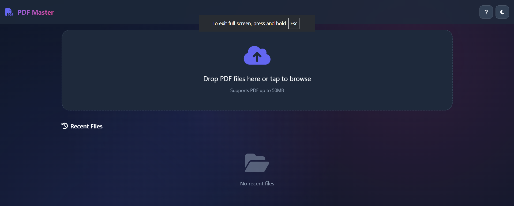

# PDF Editor

A lightweight, ad-free PDF editor built from scratch for a better user experience.

## About

After using many PDF editors filled with ads and poor usability, I decided to create my own. This project aims to provide a clean, intuitive, and user-friendly PDF editing solution.

## Features

- 📄 Simple PDF viewing and editing
- 🎨 Intuitive user interface
- ⚡ Fast and lightweight
- 🚫 No ads or bloatware
- 💻 Cross-platform support

## Getting Started

### Prerequisites

- Modern web browser with JavaScript enabled
- Node.js (optional, if running locally)

### Installation

1. Clone the repository
```bash
git clone https://github.com/yourusername/pdf-editor.git
cd pdf-editor
```

2. Open `index.html` in your browser or serve it locally

## Usage

[Add instructions on how to use the PDF editor]

## Screenshots


*Main interface with document loaded*


*Available editing tools and options*


*Document management features*

> Replace the image URLs with your own screenshots. You can upload images to GitHub issues, use imgur.com, or use relative paths like `./screenshots/interface.png` if you store them in a screenshots folder.

## Technologies Used

- HTML5
- CSS3
- JavaScript

## Contributing

Contributions are welcome! Please feel free to submit a Pull Request.

## License

This project is licensed under the MIT License - see the LICENSE file for details.

## Acknowledgments

- Built as an alternative to feature-bloated PDF editors 